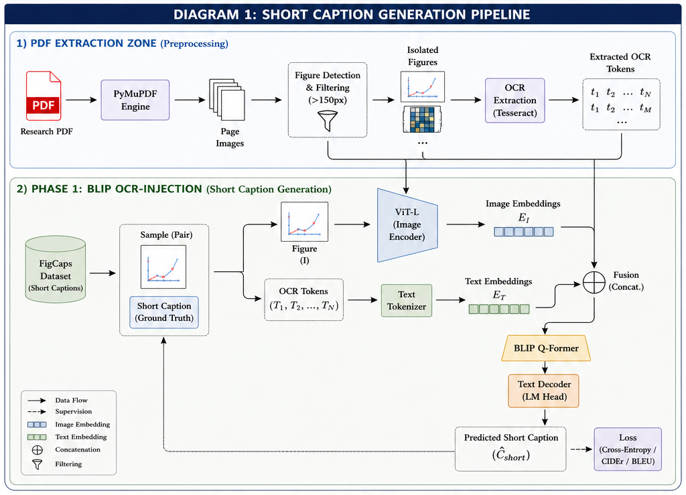
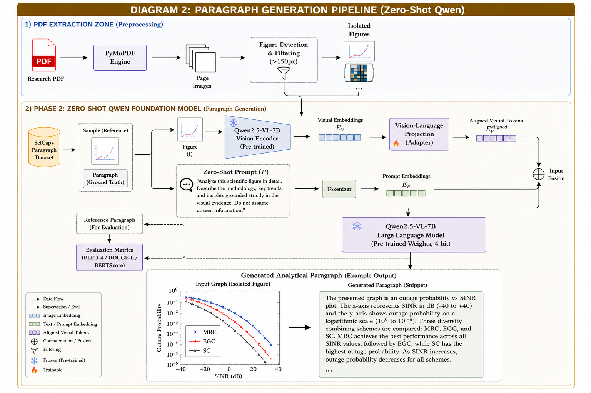

# Sci-Fig Analyzer: End-to-End Scientific Figure Comprehension


## Overview
Sci-Fig Analyzer is a complete end-to-end Machine Learning pipeline and Web Application designed to automatically extract, comprehend, and describe complex scientific figures from research papers. 

This repository tackles two distinct challenges in Vision-Language Models (VLMs):
1. **Short Caption Generation:** Enhancing traditional VLMs (BLIP) with OCR tokens to accurately describe the literal content of a figure.
2. **Paragraph-Length Analytical Descriptions:** Using modern foundational VLMs (Qwen2.5-VL) to generate 150-word, research-grade paragraphs that deduce methodologies and trends directly from the visual data.

---

## 📊 Quantitative Results & Findings

### Phase 1: Short Caption Generation (BLIP-Base)
Our first major contribution was improving upon the original FigCaps-HF baseline. By extracting raw OCR text from figures and injecting it into the prompt of a BLIP-base model alongside quality filtering, we significantly outperformed the original paper on the full 13,355-sample test set.

| Metric | Original Paper Baseline | **Our OCR-Injected BLIP** | Improvement |
| :--- | :---: | :---: | :---: |
| **BLEU-1** | 0.2039 | **0.2514** | +23.2% |
| **BLEU-4** | 0.0140 | **0.0373** | **+166.4%** |
| **METEOR** | 0.0763 | **0.1066** | +39.7% |

### Phase 2: Paragraph Generation (Qwen2.5-VL-7B)
We discovered that fine-tuning VLMs on domain-specific "mention-paragraphs" (like the SciCap+ dataset) paradoxically *degrades* performance by destroying the model's visual grounding (causing hallucination of mathematical formulas not present in the image). We demonstrate that **Zero-Shot Foundation Models (Qwen2.5-VL-7B) prompted correctly** vastly outperform fine-tuned models for analytical figure descriptions.

**Zero-Shot Evaluation on 13,355 Test Samples:**
Because Qwen generates ~150-word analytical paragraphs while the ground-truth dataset only contains ~15-word literal captions, traditional n-gram exact match scores (like BLEU-4) are mathematically penalized. Therefore, **ROUGE-L (Recall)** is our primary success metric, demonstrating that Qwen successfully captures nearly 38% of the literal ground-truth concepts while simultaneously expanding on the methodology and data trends.

| Metric | Score | Analysis |
| :--- | :---: | :--- |
| **ROUGE-L (Recall)** | **0.3782** | **Primary Metric.** Shows high retention of ground-truth concepts. |
| **METEOR** | **0.1342** | Strong semantic alignment despite extreme length differences. |
| **ROUGE-L (F1)** | 0.0743 | Deflated due to the precision penalty of generating longer text. |
| **BLEU-1** | 0.0459 | Baseline lexical overlap. |
| **BLEU-4** | 0.0034 | Mathematically breaks down when comparing paragraphs to short captions. |

### 📝 Sample Generated Paragraph
**Input:** Network Outage Probability Graph (Figure 6)
**Qwen2.5-VL-7B Output (Zero-Shot):**
> *The presented graph is an outage probability versus Signal to Information Ratio (SINR) plot, typically used in communication systems analysis. On the x-axis, it represents SINR in dB values ranging from -40 to +40, indicating signal quality with respect to noise and interference levels. The y-axis on the left side shows outage probability, which quantifies the likelihood that a system will fail due to excessive interference or noise below certain performance criteria. Three curves are plotted for different standard deviations σ...*

---

## 📥 Datasets and Checkpoints

Before running the code, you must download the datasets and our trained model weights.

1. **Datasets:**
   - **FigCaps-HF Dataset:** Contains the 13,355 test images and short ground-truth captions. [Download FigCaps Dataset Here](#) *(Replace with actual link)*. Place the images in `figcaps_data/No-Subfig-Img/` and JSONs in `figcaps_data/Caption-All/`.
   - **SciCap+ Dataset:** Used for our paragraph fine-tuning experiments. [Download SciCap Dataset Here](#) *(Replace with actual link)*.
2. **Trained Checkpoints:**
   - Because model weights are large, they are hosted on Hugging Face instead of GitHub. 
   - **Download our Model Checkpoints:** [Hugging Face Repository: Praneel2005/Sci-Fig-Analyzer-Checkpoints](https://huggingface.co/Praneel2005/Sci-Fig-Analyzer-Checkpoints)
   - Place the downloaded checkpoint folders inside the `archive/checkpoints/` directory.

---

## 🛠️ Step-by-Step Execution Guide

Follow these steps to replicate our findings from scratch.

### Step 1: Environment Setup
```bash
# Clone the repository
git clone https://github.com/Praneel2005/Sci-Fig-Analyzer-.git
cd Sci-Fig-Analyzer

# Create a conda environment
conda create -n figcaps python=3.9 -y
conda activate figcaps

# Install dependencies
pip install -r requirements.txt
```

### Step 2: Run Phase 1 BLIP Training (Short Captions)
To train the BLIP model with OCR injection on the FigCaps training set:
```bash
python scripts/training/train_blip_improved.py
```
To evaluate the trained BLIP model on the 13,355 test set:
```bash
python scripts/evaluation/test_blip_improved.py
```

### Step 3: Run Phase 2 Qwen Paragraph Generation
To generate zero-shot paragraphs using Qwen2.5-VL on a sample of test figures for human evaluation:
```bash
# Requires a GPU with at least 16GB VRAM (runs in 4-bit/FP16)
python scripts/evaluation/qwen_zeroshot_paragraphs.py
```
To run the massive full 13k quantitative matrix evaluation for Qwen:
```bash
python scripts/evaluation/eval_qwen_full.py
```

---

## 🏗️ System Architecture

Our complete pipeline is divided into two phases, seamlessly moving from Data Preprocessing into advanced Vision-Language reasoning.

### Phase 1: Short Caption Generation Pipeline
In the first phase, we extract raw text from figures using OCR and inject it into the BLIP architecture, which allows the model to "read" the axes and legends of scientific plots.


### Phase 2: Paragraph Generation Pipeline
In the second phase, we utilize the Qwen2.5-VL Foundation Model in a Zero-Shot capacity. A Vision-Language Projection layer translates visual embeddings into the LLM's semantic space, allowing the model to generate robust, analytical paragraphs without suffering from fine-tuning hallucination.


---

## 🚀 Web Application

We provide a beautiful, modern React + FastAPI web application that allows users to upload any research PDF. The backend automatically extracts the figures using `PyMuPDF` and streams AI-generated analytical paragraphs to the frontend using Server-Sent Events (SSE).

### Running the App
1. Ensure Node.js is installed (`conda install -c conda-forge nodejs`).
2. Install frontend dependencies:
```bash
cd frontend
npm install
cd ..
```
3. Use our unified startup script:
```bash
chmod +x start_app.sh
./start_app.sh
```
This will start the FastAPI backend on `http://localhost:8000` and the React frontend on `http://localhost:5173`. Open the frontend link in your browser to begin!

---

## 📁 Repository Structure

```text
/FigCapsHF
├── backend/                  # FastAPI app and PyMuPDF extraction logic
├── frontend/                 # React + Vite web application
├── scripts/                  
│   ├── training/             # Scripts for BLIP & LoRA fine-tuning
│   ├── evaluation/           # Scripts for generating BLEU/ROUGE matrices
│   └── data_prep/            # Dataset parsing and filtering scripts
├── archive/                  # Historical data (do not delete!)
│   ├── logs/                 # Output logs from massive training runs
│   ├── results/              # Quantitative evaluation matrices (.json/.csv)
│   └── legacy_experiments/   # Deprecated scripts (e.g. failed template models)
├── README.md                 
├── requirements.txt          
└── start_app.sh              # Web app entrypoint
```
