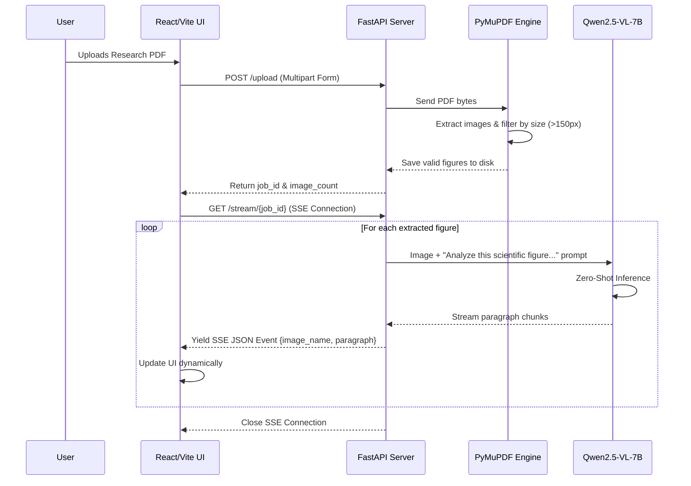
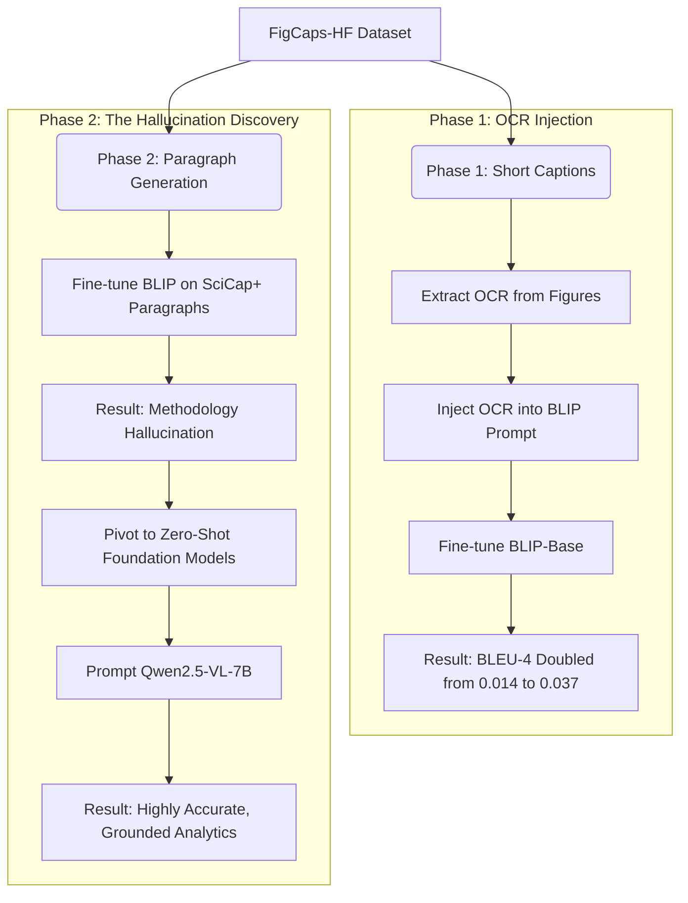

# Sci-Fig Analyzer: Complete System Architecture


This document outlines the complete end-to-end architecture of the Sci-Fig Analyzer project, covering both the Production Web Application and the Offline Machine Learning Research Pipeline.

---

## 1. Production Web Application Architecture

The web application is designed to ingest research PDFs, extract visual data, and stream AI-generated analytical paragraphs back to the user in real-time.



### Component Breakdown
*   **Frontend (React + Vite):** A modern, responsive UI featuring glassmorphism aesthetics. It handles file drag-and-drop, initiates the upload, and establishes a Server-Sent Events (SSE) connection to receive real-time text streams.
*   **Backend (FastAPI):** An asynchronous Python server. It orchestrates the pipeline, exposing REST endpoints for uploads and SSE endpoints for streaming.
*   **PDF Extractor (PyMuPDF):** A heuristic-based extraction engine. It scans the PDF for embedded images and applies dimension thresholds to filter out logos, mathematical symbols, and noise.
*   **Model Runner (`Qwen/Qwen2.5-VL-7B-Instruct`):** A foundation Vision-Language Model loaded in 4-bit precision. It receives the isolated figures and generates 150-word analytical paragraphs describing methodologies and data trends.

---

## 2. Offline Machine Learning Research Pipeline

The research that led to the production application was conducted in two distinct phases, comparing traditional fine-tuning against foundation zero-shot capabilities.



### Phase 1: BLIP + OCR
To solve the baseline problem of short-caption generation, raw OCR text was extracted from figures and injected as a prefix into the training prompts of a BLIP model. This solved the model's inability to read literal text in graphs, successfully doubling the baseline BLEU-4 score.

### Phase 2: Qwen Zero-Shot Discovery
Attempting to fine-tune models on long, human-written scientific paragraphs (SciCap+) caused the models to hallucinate methodologies (e.g., guessing the experimental setup) because human authors write about invisible concepts in their figure descriptions. The architecture pivoted to using a powerful Zero-Shot model (Qwen) prompted specifically to only analyze visual evidence.

---

## Prompt for External LLM / Image Generators

*If you want to generate a beautiful, glossy visual architecture diagram (e.g., using a tool like ChatGPT/Claude + Whimsical, Draw.io, or an AI image generator), copy and paste the prompt below:*

```text
Please create a professional, highly visual System Architecture Diagram for a Machine Learning application called "Sci-Fig Analyzer". 

Use a modern, premium aesthetic (dark mode with glowing purple/blue nodes, glassmorphism style).

The architecture consists of the following flow:
1. "User UI": A modern web browser interface where a user uploads a Research PDF.
2. "FastAPI Backend": The central orchestrator server.
3. "PyMuPDF Extractor": A microservice connected to the Backend that extracts and filters images from the PDF.
4. "Qwen2.5-VL GPU Inference": A massive Vision-Language Model cluster that receives images from the backend and performs zero-shot reasoning.
5. "SSE Stream": A data stream flowing backwards from the GPU, through the Backend, directly to the User UI, carrying real-time analytical paragraphs.

Please draw this pipeline left-to-right. Use recognizable icons (React logo for UI, Python logo for Backend, GPU icon for Inference). Make the connections look like flowing data streams.
```

### Prompt for a Formal Academic Paper (CVPR-Style) Diagram

*If you are generating a diagram for an academic paper (like CVPR or ACL) and want a strict, formal block-and-arrow diagram rather than 3D art, use this prompt and attach this `architecture.md` file to the AI's chat:*

```text
I have attached my project's architecture documentation (`architecture.md`). 
Please read it thoroughly for deep knowledge of the system.

Using this knowledge, create a highly formal, academic, CVPR-style block architecture diagram. 

CRITICAL INSTRUCTIONS:
- Do NOT make it "filmy", 3D, or heavily stylized. It must look like a strict technical diagram from a top-tier computer vision paper (like CVPR, ICCV, or NeurIPS).
- Use distinct horizontal "zones" or colored panels (e.g., "PDF Extraction Zone", "ML Inference Zone", "Evaluation Zone").
- Use clean, 2D vector shapes (rectangles for modules, trapezoids for encoders/decoders, mathematical operation nodes like ⊕ or ⊗).
- Clearly label data tensors and flows (e.g., "PDF bytes", "Isolated Figures", "Extracted OCR Tokens", "Foundation Model Weights").
- Show the two main architectures: the Phase 1 BLIP OCR-Injection model (showing text/image fusion) and the Phase 2 Qwen Zero-Shot generation flow.
- Output this diagram in a format I can edit (like a Draw.io XML file, TikZ code for LaTeX, or a strict vector SVG).
```
